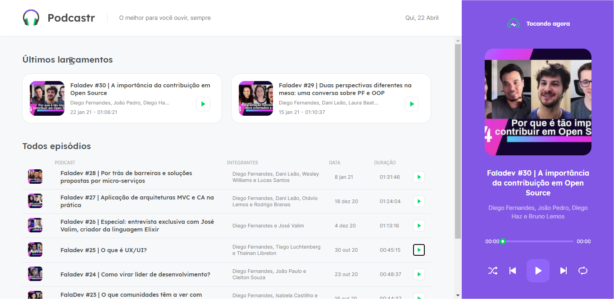
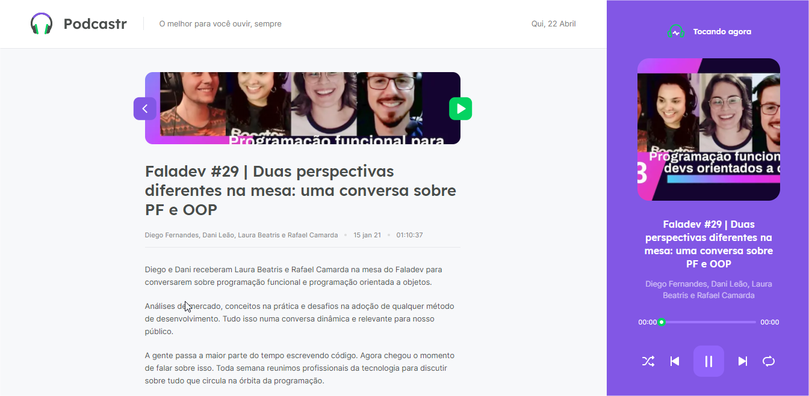

<h1 align="center">
    
</h1>

<p align="center">
  
  
       

  
</p>

<br>

<p align="center">
  
</p>

## 🧪 Tecnologias

Este projeto foi desenvolvido utilizando as seguintes tecnologias:

- [Next.js](https://nextjs.org/)
- [React](https://reactjs.org)
- [TypeScript](https://www.typescriptlang.org/)

## 🚀 Para iniciar o projeto

Clone o projeto e acesse a pasta

```bash
$ git clone https://github.com/diegohfcelestino/podcastr_next_nlw5.git && cd podcastr_next_nlw5
```

Siga os seguintes passos
```bash
# Install the dependencies
$ yarn

# Start the project
$ yarn dev
```

## 💻 Projeto

[Podcastr](https://podcastr-nlw.vercel.app/) para aproximar você ainda mais do que há de melhor em podcasts de tecnologia!💜

Este é um projeto desenvolvido durante a **[Next Level Week](https://nextlevelweek.com/)**, apresentado por **[@Rocketseat](https://github.com/Rocketseat)** 19 a 25 de abril de 2021.

## 🔖 Layout

### Home

<p align="center">
  
</p>

### Informações do podcast

<p align="center">
  
</p>


## 📝 Licença

Este projeto está licenciado sob a Licença MIT. Consulte o arquivo de[LICENÇA](LICENSE.md) para obter detalhes.


---

## Autor

<p align="center">Feito com 💜 e dedicação por Diego Henrique Ferreira</p>